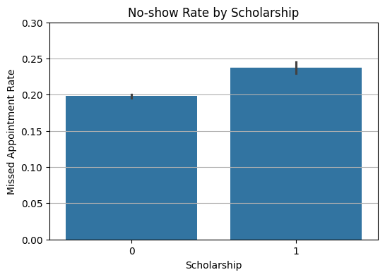
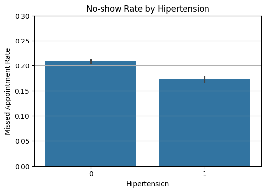
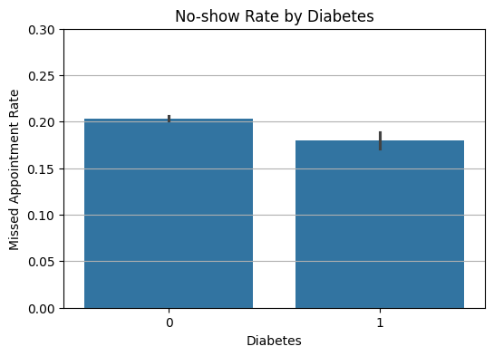
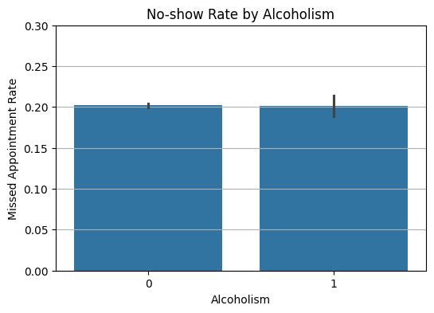
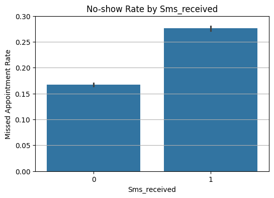
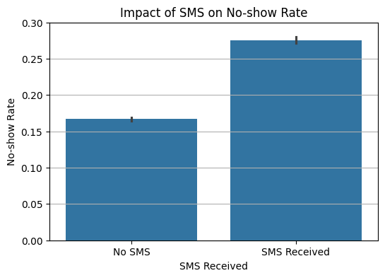
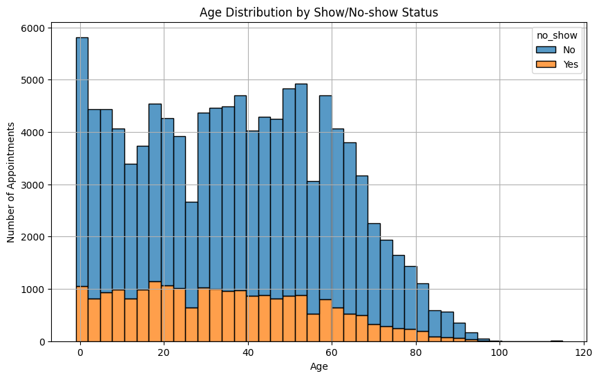

# 📅 No-show Medical Appointments Analysis

This project is part of the **Data Analyst Nanodegree** from **Udacity**. It explores a dataset of over 100,000 medical appointments in Brazil to uncover what factors influence whether patients attend their scheduled appointments.

The full analysis — including data cleaning steps, exploration, and conclusions — is available in the included Jupyter notebook:  
[`notebook/Investigate_a_Dataset.ipynb`](notebook/Investigate_a_Dataset.ipynb)

---

## Research Questions

- What factors are associated with higher no-show rates?
- Does receiving an SMS reduce the probability of missing an appointment?
- Are older patients more likely to show up?

---

## Dataset

The dataset was obtained from [Kaggle](https://www.kaggle.com/joniarroba/noshowappointments) and includes:

- Appointment dates
- Patient demographics
- Medical conditions
- SMS reminders
- Final attendance outcome

---

## Data Cleaning Summary

- Standardized column names to snake_case
- Converted date columns to datetime format
- Created a binary target column: `no_show_binary` (1 = missed, 0 = attended)
- Removed duplicate rows

---

## Key Visualizations

### 1. No-show Rate by Different Factors

These bar charts show how various patient attributes affect the likelihood of missing appointments.

| Scholarship | Hypertension | Diabetes |
|-------------|--------------|----------|
|  |  |  |

| Alcoholism | SMS Received | SMS Impact |
|------------|---------------|-------------|
|  |  |  |

---

### 2. Age Distribution by Show/No-show

This histogram illustrates how appointment attendance varies across age groups.  
Older patients appear more likely to show up than younger ones.

